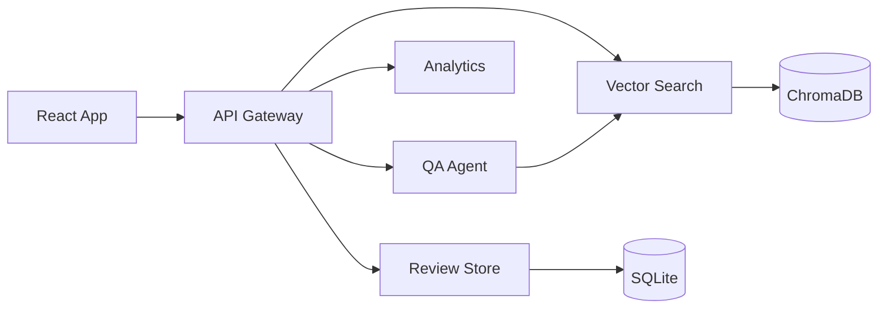

# Vox Auditor

Product review intelligence for product owners.

Vox Auditor groups customer reviews in a local vector database and lets you ask questions about complaints — including whether an issue is getting worse or better over time.

No cloud API keys. Everything runs on your machine.

Built by **[Girish Daruru](https://github.com/DaruruGirish)**.

## Features

- **Dashboard** — complaint trends across products and months
- **Review Explorer** — search and filter real customer reviews
- **Intelligence Agent** — ask questions in plain English, answers cite actual reviews
- **Local NLP** — embeddings and retrieval run locally with ChromaDB

## Quick start

The easiest way to run everything:

```bash
docker compose up --build
```

Then open:

| What | URL |
|------|-----|
| App | [http://localhost:8080](http://localhost:8080) |
| API docs | [http://localhost:8081/docs](http://localhost:8081/docs) |

Stop with `Ctrl+C`, then `docker compose down`.

## Architecture



| Service | Port | Role |
|---------|------|------|
| Frontend | 8080 | React dashboard |
| Gateway | 8000 | Single API entry point |
| Review Store | 8001 | Reviews in SQLite |
| Vector Search | 8002 | Embeddings + ChromaDB |
| Analytics | 8003 | Dashboard stats and trends |
| QA Agent | 8004 | Question answering over reviews |

## Run locally (without Docker)

**1. Backend**

```bash
python -m venv .venv
```

Windows:

```bash
.venv\Scripts\activate
pip install -r requirements.txt
python start_all.py
```

macOS / Linux:

```bash
source .venv/bin/activate
pip install -r requirements.txt
```

Then start each service from its folder (`services/review_store`, `vector_search`, `analytics`, `qa_agent`, `gateway`) with `python main.py`.

**2. Frontend**

```bash
cd frontend
npm install
npm run dev
```

Open [http://localhost:5173](http://localhost:5173). The Vite proxy forwards `/api` to the gateway on port 8000.

## Project structure

```
VoxAuditor/
├── frontend/            React + Vite app
├── services/
│   ├── gateway/         API gateway
│   ├── review_store/    Review data
│   ├── vector_search/   Semantic search
│   ├── analytics/       Trends and dashboard
│   └── qa_agent/        Q&A over reviews
├── shared/              Shared data and SQLite helpers
├── scripts/             Sample data generator
└── docker-compose.yml
```

## Tech stack

Python · FastAPI · ChromaDB · sentence-transformers · React · Vite · Docker
